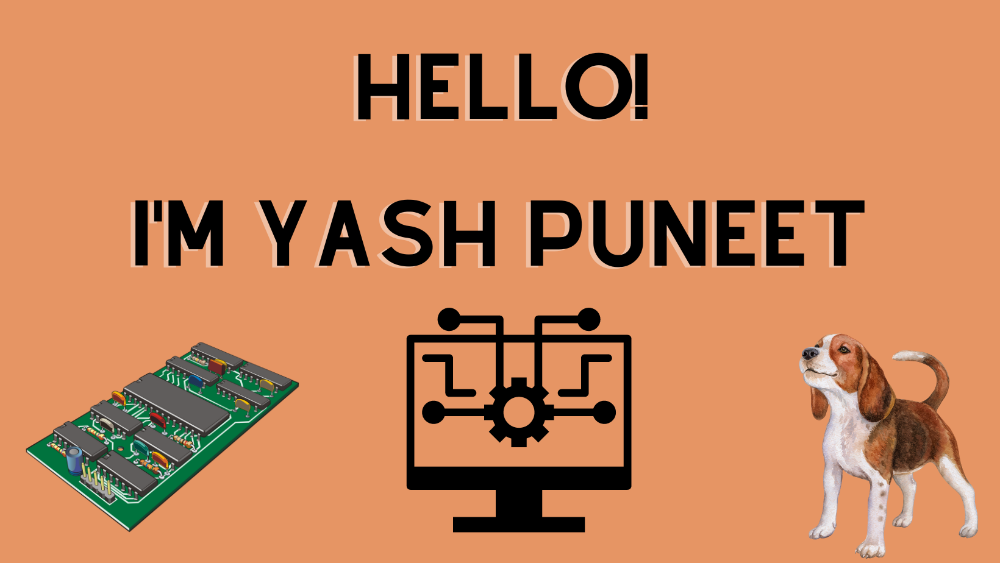

# Hello! Welcome to my WebPage!



### Name: Yash Puneet
### Last Updated: October 2<sup>nd</sup>, 2022 

> Computers are incredibly fast, accurate, and stupid. Human beings are incredibly slow, inaccurate, and brilliant. Together they are powerful beyond imagination. - Albert Einstein


###### Hi! I am Yash

[My LinkedIn Profile](https://www.linkedin.com/in/yashpuneet)

[My Resume](docs/Resume.pdf)

```
Code Snippet
```

#### My Professional Goals as a Student:

1. Learn the expectations and standards of industry level projects
2. Network with professionals and peers
3. Participate in research projects, cross-disciplinary if possible
4. Learn about the various technologies useful for software engineering and
   robotics

#### My Personal Goals as a Student:

1. Attend Social Events
	* Improve networking skills
	* Make New Friends
		* Get better and staying in touch
2. Travel and Explore 
	* Plan trips to cities and landmarks

#### Things to do before Graduating:
- [X] Take a course about animal behaviour and psychology
- [X] Watch the sunset and Gliderport
- [X] Join a Club/Organisation and be an active member
- [ ] Secure and complete an intership
- [ ] Go Paragliding
- [ ] Explore 3 Hiking trails in San Diego 

#### Things to add to this page:
* Section Links
* Text Styling
* Resized Images
* About Me Paragraph
* Projects
* Skills
* Links to Github Respositories

