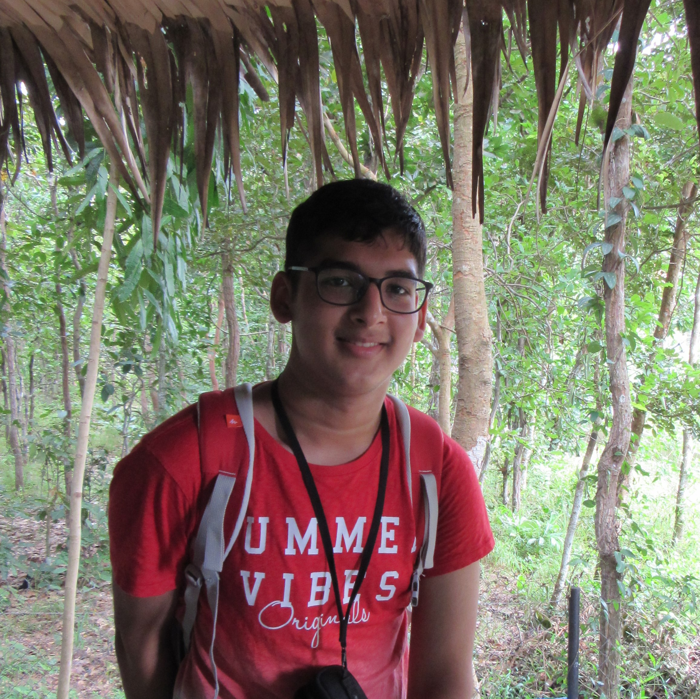

# Hello! Welcome to my WebPage!


### Name: Yash Puneet
### Last Updated: October 2<sup>nd</sup>, 2022 

<br>

> Computers are incredibly fast, accurate, and stupid. Human beings are incredibly slow, inaccurate, and brilliant. Together they are powerful beyond imagination. - Albert Einstein

<br>



### About Me:

Hi! My name is Yash and I am an **Undergraduate** student at the ***University of California, San Diego***, majoring in *Computer Engineering* with a minor in *Psychology*. I enjoy the thrill of innovative project development and cross-disciplinary research and have worked with Simultaneous Localisation and Mapping Algorithms and improved their performance by combining them with human cognitive models. Below is My LinkedIn Profile and Resume! I look forward to connecting with you!

[My LinkedIn Profile](https://www.linkedin.com/in/yashpuneet)

[My Resume](docs/Resume.pdf)

Here is an interesting code snippet I found regarding HTTP Redirects:

```
const httpsRedirect = () => {
  if (location.protocol !== 'https:')
    location.replace('https://' + location.href.split('//')[1]);
};

httpsRedirect();
// Redirect from http://mydomain.com to https://mydomain.com
```
###### Source: https://dev.to/swastikyadav/9-useful-code-snippets-for-everyday-javascript-development-part-1-478a


<br>

#### My Professional Goals as a Student:

1. Learn the expectations and standards of industry level projects
2. Network with professionals and peers
3. Participate in research projects, cross-disciplinary if possible
4. Learn about the various technologies useful for software engineering and
   robotics

<br>

#### My Personal Goals as a Student:

1. Attend Social Events
	* Improve networking skills
	* Make New Friends
		* Get better and staying in touch
2. Travel and Explore 
	* Plan trips to cities and landmarks

<br>

#### Things to do before Graduating:
- [X] Take a course about animal behaviour and psychology
- [X] Watch the sunset and Gliderport
- [X] Join a Club/Organisation and be an active member
- [ ] Secure and complete an intership
- [ ] Go Paragliding
- [ ] Explore 3 Hiking trails in San Diego 

<br>

#### Things to add to this page:
* ~~Section Links~~
* ~~Text Styling~~
* Resized Images
* ~~About Me Paragraph~~
* Projects
* Skills
* Links to Github Respositories

